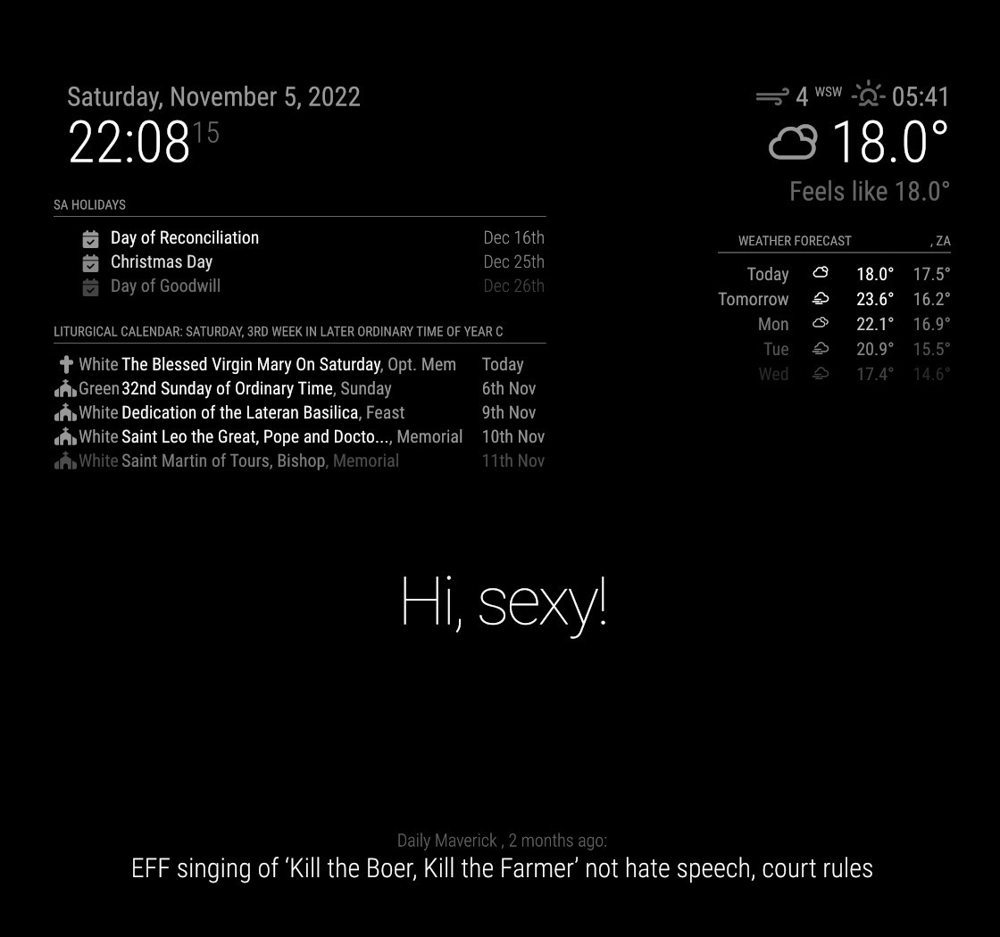

# Module: MMM-catholic-liturgical-calendar

A liturgical calendar that lists upcoming events in the Christian year. This is a module for the [MagicMirror²](https://github.com/MichMich/MagicMirror) project.

A church glyph indicates that this is a mandatory church day.

## Installation
1. Navigate to the `MagicMirror/modules` directory.
2. Execute `git clone https://github.com/IgniparousTempest/MMM-catholic-liturgical-calendar.git`
3. Install a dependency: `npm install romcal`
4. Configure the module as per below.
5. Restart MagicMirror

## Using the module

Add this to the `/config/config.js` file:

    {
        module: "MMM-catholic-liturgical-calendar",
        position: "top_left",
        config: {}
    },

Copy the parent folder to `/modules/`.

## Configuration options

The following properties can be configured:

| Option                       | Description
| ---------------------------- | -----------
| `fade`                       | Fade the future events to black. (Gradient)    **Possible values:** `true` or `false`   **Default value:** `true`
| `numberOfDaysOnCalendar`     | The number of days to show a forecast for..    **Default value:** `7`
| `requiredChurchEvents`       | The events that your church requires attendance for. The default is what has been historically expected, but "liberal" churches often require less.    **Possible values:** `['SOLEMNITY', 'SUNDAY', 'TRIDUUM', 'HOLY_WEEK', 'FEAST', 'MEMORIAL', 'OPT_MEMORIAL', 'COMMEMORATION', 'FERIA']`   **Default value:** `['SOLEMNITY', 'SUNDAY', 'TRIDUUM', 'HOLY_WEEK', 'FEAST', 'MEMORIAL']`

## In action

## Notes

Data is retrieved from the data from the [romcal](https://www.npmjs.com/package/romcal) npm module. I wrote an alternative data provider which is a web scraper: [data_scraper](./data/data_scraper.py).